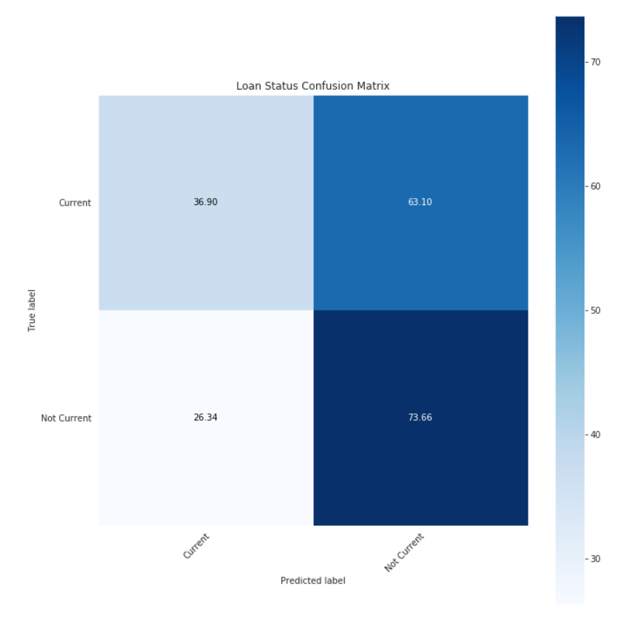
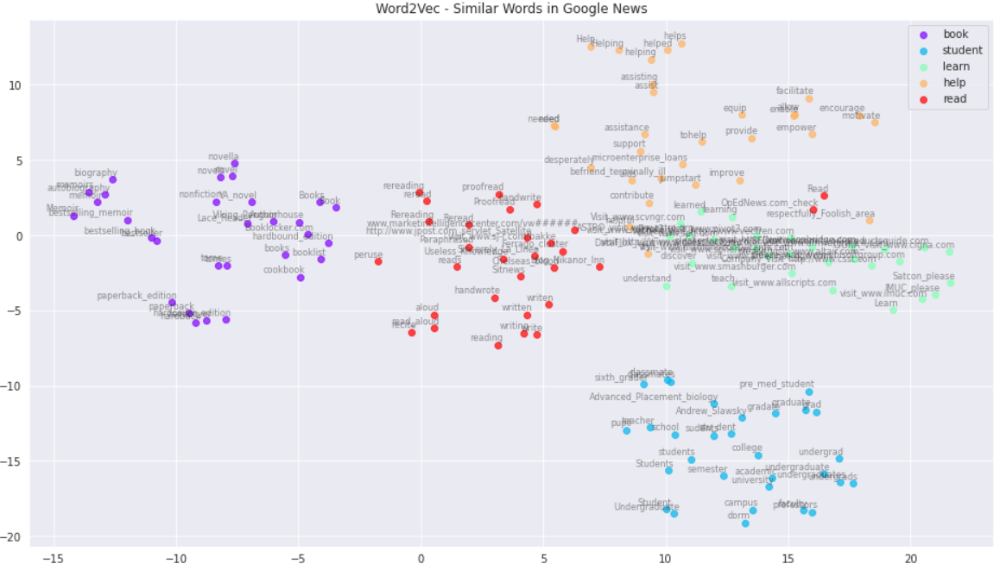
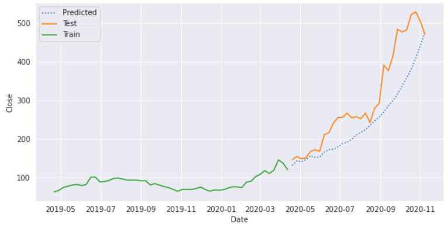
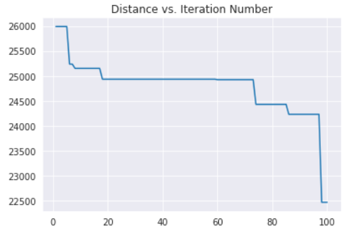
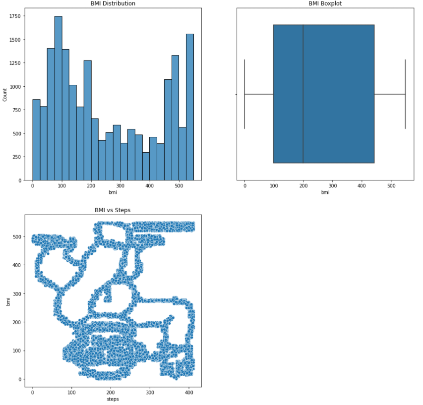

### Portfolio

<table class="wide">
<tr>
    <td class="left">
        
    </td>
    <td class="right">
        
    </td>
</tr>
<tr>
    <td class="left">
        
    </td>
    <td class="right">
        
    </td>
</tr>
<tr>
    <td class="left">
        
    </td>
</tr>
</table>

    

        <ul class="nav">
            <li><a href="index.html">Back</a></li>
        </ul>
    

